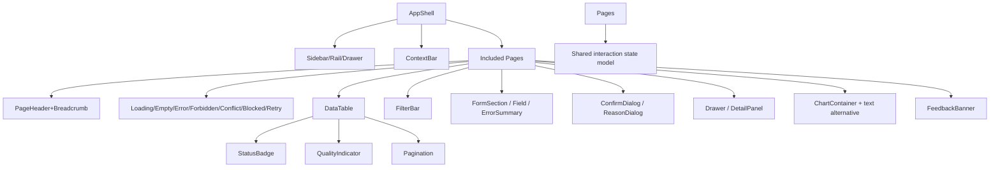

# Component Contracts

**Feature**: 004 Industrial Operations UI/UX Redesign
**Created**: 2026-08-04

## 1. Ownership and scope

Shared presentational + behavioral primitives live in `src/Web/src/components/` (new directory),
styled via CSS classes in `src/Web/src/App.css` after token migration (design-system.md). Feature
folders (`features/{configuration,simulator,telemetry,audit,dashboard,setup}`) keep their domain
logic; they consume these primitives. The existing `AppShell`/`transitionAppShell` pure contract
and the `ManagementState` union are preserved and promoted as the shared interaction model.

Small, coherent set only — no component created merely to inflate the system (prompt §8). Each
contract defines purpose, inputs/state, visual hierarchy, keyboard/a11y, responsive, and
loading/error/empty behavior.

## 2. Contract inventory

### C-01 AppShell
- Purpose: consistent shell (FR-001): brand, grouped sidebar (expanded/rail/drawer), context bar
  (Site/Area, timezone, cutoff/freshness), session/user/role, logout, skip link, `#main-content`,
  landing resolution (D-001), feedback live region.
- State: extends `AppShellState` with `navMode` (`expanded|rail|drawer-open`), `landingResolved`.
- Keyboard/a11y: skip link; drawer focus trap/Escape/focus-return; `aria-current`; live region.
- Responsive: tiers per responsive-accessibility.md.
- Loading/error/empty: session states already handled (`loading/error/forbidden/expired` notices).

### C-02 Grouped Sidebar / Rail / Drawer
- Purpose: navigation by operational groups; permission-safe visibility (FR-002).
- Inputs: routes, groups, active route, navMode, onNavigate, onToggle.
- A11y: accessible toggle name; icon-only rail items have aria-label + tooltip; active item has
  `aria-current="page"` + icon (non-color); drawer focus trap + Escape + focus restore.
- Responsive: expanded >=1280; rail+drawer 768–1279; rail preserved <768.

### C-03 Top/Context Bar (scope selector + context)
- Purpose: Site/Area, timezone, cutoff/freshness, user/role, logout (FR-005).
- Behavior: one-site stays visible (maybe non-editable); scope label from server; no metadata leak.
- A11y: labeled select controls; freshness with text state.

### C-04 Page Header / Breadcrumb
- Purpose: page title (vi), subtitle scope/time/cutoff, at most one primary action, secondary
  actions, breadcrumb for nested objects (FR-003, FR-025).
- A11y: page title h1; breadcrumb `nav` + `aria-label="Breadcrumb"`; focus move on route change.

### C-05 Operational Status Badge
- Purpose: lifecycle/severity/source/job states with text + icon (FR-016).
- Inputs: label, tone, icon glyph, optional detail.
- A11y: `role="status"` not needed for static badge; text always present.

### C-06 Data Quality Indicator
- Purpose: Good/Uncertain/Bad/Missing with icon+text+reason (FR-012, US5).
- Behavior: Missing distinct from zero; reason tooltip/detail.

### C-07 Freshness Indicator
- Purpose: Live/Stale/Degraded + last refresh + cutoff (FR-005).
- A11y: text label; not color-only.

### C-08 Feedback Banner / Notice
- Purpose: in-place success/error/blocked/conflict/retry info retaining context (FR-004/024).
- A11y: `role="status"` for success/neutral; `role="alert"` for errors; correlation shown where
  existing behavior provides it.

### C-09 Loading / Empty / Error / Forbidden / Conflict / Blocked / Retry States
- Purpose: every included page renders applicable non-happy-path state with context + next action
  (FR-004, SC-004).
- Behavior: loading skeleton/spinner; empty distinguishes no-records vs no-filter-match vs no-scope;
  error keeps context and correlation; conflict offers reload/compare; blocked shows reason + next
  step; retry explicit.
- A11y: loading region announced; error `role="alert"`.

### C-10 DataTable
- Purpose: compact operational tables for configuration/run-history/audit/current data
  (FR-013, FR-027).
- Inputs: columns (header/width/sort), rows, row actions, selection where needed, density
  (compact only, no switch), pagination slot.
- Behavior: visible sort/filter state, readable column hierarchy, row actions explicit
  (button/link, not whole-row click); tablet row-card wrap or scroll region; header sticky for
  long lists.
- A11y: `th scope`, sort announced, focusable actions.

### C-11 FilterBar
- Purpose: stable filters (search, select, date range) with visible active state (FR-013/015).
- Behavior: URL shareable when no secret; result count visible; tablet → filter drawer.
- A11y: labeled controls; apply/reset accessible.

### C-12 Pagination
- Purpose: long tables/lists (config, simulator history, audit).
- Behavior: preserves investigation context (FR-015); page size consistent (current pageSize 20).
- A11y: `nav aria-label`; current page announced; focus maintained.

### C-13 FormSection + FieldErrorSummary + Field
- Purpose: configuration/rule-like forms: grouped fields, required marks, field + summary errors,
  first-invalid focus, preserve input on validation failure, unsaved-change warning
  (FR-008/014).
- A11y: label association, `aria-describedby`, `role="alert"` summary, save/cancel/retry/conflict
  outcomes.

### C-14 ConfirmDialog / ReasonDialog
- Purpose: destructive lifecycle actions require confirmation + reason per policy (FR-009/014).
- Behavior: unambiguous cancel; never silent overwrite (conflict → reload/compare);
  reason required where policy requires.
- A11y: `role="dialog"`, focus trap, Escape closes (or explicit), focus restoration.

### C-15 Drawer / DetailPanel
- Purpose: quick detail (audit event, point, run) without long modal (DOC-08 UX-D08); complex
  workflows use pages, not multi-step modal.
- A11y: focus trap, Escape, background block, focus return (same contract as nav drawer).

### C-16 Tabs
- Purpose: point/history/quality/source sections (DOC-08 §18.1) — used where surfaced;
  keyboard roving tabindex with `role="tablist"`/`tab`/`tabpanel`.

### C-17 ChartContainer + textual alternative
- Purpose: SVG time-series with chart metadata (metric/unit/timezone/cutoff/grain/quality/
  coverage) and its textual/table alternative (FR-018/020; D-007).
- Behavior: Missing = gap; threshold dashed; markers shaped; no dual axis/3D.

## 3. Component hierarchy

## 4. Where each contract should/should not be used

- Compact DataTable + FilterBar + Pagination: operational queues, configuration lists, run
  history, audit. Not for detail panels, forms, dialogs, or explanatory content (FR-027).
- Drawer/DetailPanel: quick detail; long evidence flows use pages.
- ConfirmDialog/ReasonDialog: destructive/config-affecting lifecycle only (FR-009).
- ChartContainer: only where the underlying data exists (dashboard trend, point series); never a
  decorative chart (UX-P02).