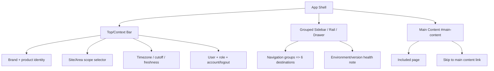

# Information Architecture

**Feature**: 004 Industrial Operations UI/UX Redesign
**Created**: 2026-08-04

## 1. Navigation groups (DOC-08 §8 task-based grouping; FR-002)

Groups follow operational tasks, not backend module names. Conditional capabilities never appear
(FR-026). Existing routes are preserved.

| Group | Destination | Vietnamese label | Route | Current route mapping |
|---|---|---|---|---|
| Vận hành (Monitoring) | Operational Dashboard | Vận hành | `dashboard` | existing `dashboard` |
| Vận hành (Monitoring) | Current Data & Health | Dữ liệu & tình trạng | `telemetry` | existing `telemetry` |
| Cấu hình (Configuration) | Configuration | Cấu hình | `configuration` | existing `configuration` |
| Cấu hình (Configuration) | Simulator | Mô phỏng | `simulator` | existing `simulator` |
| Quản trị / Hệ thống (Governance) | Audit | Nhật ký | `audit` | existing `audit` |
| Thiết lập (Setup) | Setup | Thiết lập | `setup` | existing `setup` |

Layout: desktop wide sidebar lists groups with a group heading; tablet rail shows top-level
destinations as icons with tooltips; drawer shows full groups. Active destination keeps
`aria-current="page"` and a primary-background + non-color cue (icon persist) — not color alone
(FR-016).

## 2. Application shell structure



## 3. Scope and context persistence (FR-005, FR-025)

- Site selector is the global access context (lists only permitted Sites); Area selector is a
  second filter/context with "Tất cả" when unrestricted (DOC-08 §9.2, UX-A07).
- If the user has exactly one permitted Site/Area, the control remains understandable and may be
  non-editable rather than disappearing (edge case).
- Site timezone (default `Asia/Ho_Chi_Minh`), data cutoff, and refresh/freshness (Live/Stale/
  Degraded) are visible in the context bar and/or page header on data-bearing pages (FR-005).
- Breadcrumbs use stable hierarchy and permission-safe links; never reveal out-of-scope objects.
- Back navigation and drill-down preserve scope and terminology (FR-025).

## 4. Landing behavior (FR-001/028, SC-015, D-001)

```mermaid
graph TD
  A[Authenticated session] --> B{[Valid permitted deep link?]}
  B -- yes --> C[Restore deep-linked route]
  B -- no --> F{[First enabled capability effectively permitted?]}
  F --> G[configuration -> simulator -> telemetry -> audit -> setup when authorized]
  G -- none permitted / disabled / unknown --> J{[Dashboard permitted?]}
  J -- yes --> H[permitted Dashboard fallback]
  J -- no --> K[safe no-authorized-capability state]
  H --> I[Render permitted route]
  K --> I
  C --> I
```

- Deep link precedence, permission-based priority, permitted Dashboard fallback, safe
  no-authorized-capability state, no preference persistence, never route through a forbidden page,
  and no unauthorized metadata disclosure (FR-023/028; D-001).
- `WorkspaceStatus.landing` may indicate that Setup is required, but it is not an authorization
  bypass. Setup is selected only when it is enabled, required, and effectively permitted; the
  client never exposes capability names or object metadata outside the permitted scope.
- Session expiry: return to prior route only when still valid and permitted; otherwise landing
  fallback (FR-023).

## 5. Permission behavior

- Server-side authorization is the enforcement point; UI route guards and hidden items are UX only
  (DOC-08 §26.1, repository rule). Visibility is derived from effective permission data in the
  session/workspace response and from server outcomes on errors — not from hard-coded role names
  (FR-001/028).
- Direct access to a forbidden route or out-of-scope object returns the safe forbidden/not-found
  experience with the next permitted action and no metadata leak (FR-023).

## 6. Page frame (DOC-08 §9.3; FR-003)

- Page title (Vietnamese) + subtitle explaining scope/time/cutoff.
- At most one visually primary action; secondary actions beside it or in an overflow menu.
- Stable placement: page header, then filters/content/status, then details.
- Filter state shareable via URL when it contains no secret.

## 7. Deep-link and fallback rules

- Valid permitted deep link (known included route + permitted) takes precedence over default
  landing (D-001 priority 1).
- Unknown, expired, or unauthorized deep link uses the safe forbidden/not-found experience;
  no first visit through a forbidden route; no unauthorized capability/object metadata disclosure
  (FR-023).
- The route set is unchanged (no new routes introduced, no new mobile navigation model per FR-019).
