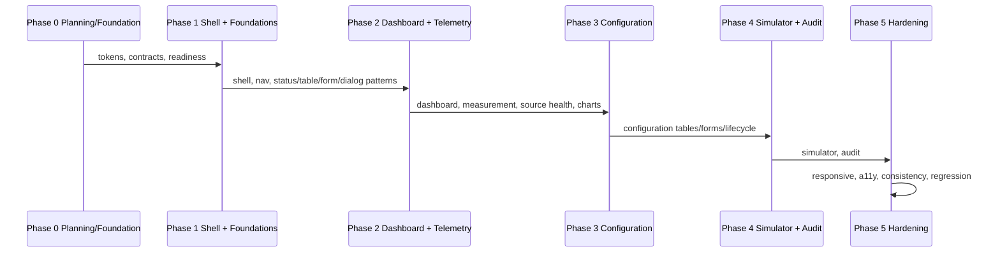

# Migration Phases

**Feature**: 004 Industrial Operations UI/UX Redesign
**Created**: 2026-08-04

## 1. Strategy

Incremental, no big-bang rewrite, no framework change, no new dependencies. Each future
`/speckit.implement` invocation executes exactly ONE phase, reaches its checkpoint, and stops.
Phase boundaries follow actual frontend coupling; tokens and shared components land first so later
pages migrate composably.

## 2. Phase definitions

### Phase 0 — Planning and visual foundation (this invocation)
- UI audit (research.md §2), design tokens (design-system.md), component contracts
  (component-contracts.md), responsive/a11y contracts, route/permission matrix, migration phases,
  test strategy, quickstart, planning checkpoint.
- Output: planning artifacts only; no production code. NOT implemented here.

### Phase 1 — Application shell and shared foundations
- Scope: AppShell (grouped sidebar, rail/drawer, context bar), landing resolution (D-001),
  skip link + focus management, DOC-08 token migration in `App.css`, removal of the dark media
  query, shared primitives (status badge, quality indicator, feedback banner, loading/empty/error/
  forbidden/conflict/blocked/retry states, DataTable, FilterBar, Pagination, ConfirmDialog,
  ReasonDialog, Drawer, FormSection/Field/ErrorSummary). Setup page shell-consistent pass.
- Verification: type-check (`tsc -b` via build), lint, `transitionAppShell`/state module checks
  (type-checked), architecture tests, manual browser evidence for expanded/rail/drawer, landing.
- Peer dependency: Dashboards/config pages keep existing behavior until P2/P3.

### Phase 2 — Dashboard and Measurement visibility
- Scope: Operational Dashboard exception-first hierarchy; Current Measurement & Source Health;
  Data Quality indicator (Good/Uncertain/Bad/Missing); freshness/cut-off context; SVG chart with
  Missing gaps; textual/table chart alternative; zero-vs-Missing preserved.
- Verification: type-check, lint, manual fixtures (zero, No Data, Good/Uncertain/Bad, stale,
  unavailable), chart gap + text alternative, Feature 003 regression.

### Phase 3 — Configuration management
- Scope: compact tables, filters, sort state, row actions, lifecycle status badges, dependency
  and Draft/edit, validation + first-invalid-focus, conflict handling, destructive confirmation
  + reason, unsaved-change warning for Sites/Areas/Assets/Measurement Points/Data Sources/Source
  Mappings/Simulator Configurations.
- Verification: type-check, lint, per-entity table/form journeys, lifecycle blocked/conflict
  cases, Feature 003 regression.

### Phase 4 — Simulator and Audit
- Scope: Simulator workspace (context → run state → controls → counters → history → outcomes),
  run history table; Audit list (filters, active-filter visibility, compact table, pagination),
  investigation detail drawer/split with redacted diff, safe forbidden/not-found, deep link.
- Verification: type-check, lint, run-outcome/error/retry fixtures, audit redaction and diff,
  deep-link + forbidden journeys, Feature 003 regression.

### Phase 5 — Responsive, accessibility, consistency, regression hardening
- Scope: desktop/tablet/mobile non-regression; keyboard + focus + contrast completeness;
  shared-state consistency; visual review with approved rendering evidence; cross-surface
  terminology/status consistency; Feature 003 acceptance regression.
- Verification: Fast + mandated Full harness where applicable, manual keyboard journeys, contrast
  review, mobile non-regression evidence for existing routes, visual QA constrained to actual
  approved rendering evidence (never invented PASS).

## 3. Phase coupling decisions

- Tokens migrate in P1 (before page restyles) to avoid two-token drift.
- Navigation grouping and landing land in P1 because every page depends on the shell.
- Charts land in P2 because dashboard/telemetry are the only included chart surfaces.
- Configuration reuses P1 primitives; no per-entity component duplication.
- Simulator/Audit self-contained in P4; audit redaction contract is preserved verbatim.

## 4. Stop gates

Each phase ends with a checkpoint recording PASS/FAIL/BLOCKED/NOT_RUN evidence, Standards/Spec
review findings, and an explicit stop. No phase may silently continue into the next; a new
`/speckit.implement` invocation is required per phase (constitution; prompt §12).

## 5. Deliberately not in a phase

- Dark theme (deferred after pilot + accessibility validation).
- New routes, new backend capability, new packages/fonts/icons/charts, native apps,
  mobile acceptance suite, density switch, landing preference.