# Responsive and Accessibility Plan

**Feature**: 004 Industrial Operations UI/UX Redesign
**Created**: 2026-08-04

## 1. Supported viewport tiers (DOC-08 §10 verbatim)

| Tier | Width | Sidebar | Layout | Table treatment |
|---|---|---|---|---|
| Desktop | `>= 1280px` | Expanded 236–248px (240px current) | 12-column grid, 24px padding, 12–16px gutters | Full compact table |
| Tablet | `768–1279px` | Collapsed rail 64–72px + accessible drawer | 1–2 columns; filter drawer | Row-card wrap or explicit scroll region with accessible treatment |
| Mobile | `< 768px` | Rail remains (never disappears); no new nav model | One column, non-regression only | Preserve essential content; no horizontal overflow of essential data |

Mobile is NOT a first-class target: no new navigation model, layout system, mobile-first
experience, package, framework, breakpoint library, or acceptance suite (FR-019). Existing mobile
routes load safely, preserve auth/authorization/scope, avoid out-of-scope metadata, present clear
errors or unsupported states, never crash/blank/destruct, and unsupported workflows direct users
to desktop or tablet without implying full support.

## 2. Responsive behavior contracts

### Sidebar (FR-002, SC-014, D-002/D-003)

```mermaid
stateDiagram-v2
  [*] --> Expanded: viewport >= 1280
  [*] --> Rail: viewport 768-1279
  [*] --> RailMobile: viewport < 768 (non-regression)
  Expanded --> Rail: narrow below 1280
  Rail --> Expanded: widen to >= 1280
  Rail --> DrawerOpen: toggle opens overlay
  DrawerOpen --> Rail: Escape / backdrop / selection; focus returns to opener
  RailMobile --> DrawerOpen: toggle
  DrawerOpen --> RailMobile: Escape / backdrop / selection
```

- Expanded: icons + labels + groups, `aria-current="page"` active item.
- Rail: icon-only items with accessible name + tooltip/flyout; toggle has accessible name
  ("Mở điều hướng"/"Đóng điều hướng"), keyboard support, visible focus.
- Drawer/overlay: focus trap, Escape closes, focus returns to opener, background interaction
  blocked (FR-020). Preference never persisted; no user setting (FR-002).
- Sidebar never disappears completely at any small breakpoint.

### Content grid and overflow

- No accidental horizontal overflow of essential content (SC-006). Tables > available width at
  tablet: either row-card layout preserving column meaning or an explicit horizontally scrollable
  region with accessible treatment (announce + keyboard scroll + preserved column headers).
- Filters move into a drawer at tablet widths; the active filter state remains visible.
- Detail panel: inline/split at desktop; drawer or full-width stack at tablet.
- Dialogs constrained to viewport with safe inset; drawers full-height with Escape/backdrop.
- Touch targets >= 44px for interactive controls at tablet and mobile widths (control height
  remains 36–40px desktop).

## 3. Accessibility plan (WCAG 2.2 AA target, no false certification claim — FR-020, SC-005)

### Keyboard and focus

- Visible `:focus-visible` ring on all interactive elements; never removed without replacement.
- Logical tab order matching visual order; skip link to `#main-content`; main-content focus
  management after route change when appropriate (move focus to page title or main region).
- All functionality reachable by keyboard: navigation, tables (row actions are links/buttons with
  accessible names), forms, pagination, dialogs, drawers, filter bar.
- Dialog/drawer: initial focus to first focusable or container; Tab/Shift+Tab loop within; Escape
  closes; focus returns to opener on close.

### Semantics and names

- Semantic headings (h1 page title, h2 sections) with sequential levels.
- Accessible names for icon-only actions (aria-label + tooltip/flyout).
- Form labels associated with inputs (`label[for]`/wrap); field-level error association
  (`aria-describedby`), error summary `role="alert"` when many errors; first invalid field
  focused (FR-008).
- Status and feedback: `role="status"`/`aria-live="polite"` for non-critical feedback;
  `role="alert"` for errors; loading regions announced; live-region feedback for background job
  completion.
- `aria-current="page"` for active nav; expanded/collapsed states announced for the drawer toggle.
- Tables: semantic headers (`th scope`), sort state announced, row actions not whole-row
  clickable without clear affordance (DOC-08 §12.1).

### Status never color-only (FR-016, UX-D07)

Every status has text + icon/shape/pattern + accessible name; color is reinforcement only.

### Reduced motion

`prefers-reduced-motion: reduce` freezes decorative motion (skeletons, transitions degrade to
instant state change) while preserving essential state announcements; motion duration 150–300ms.

### Charts

Textual/table alternative for important chart information (FR-020); chart container labels metric,
unit, timezone, cutoff, grain, quality, coverage (FR-018/SC-011).

### Language and content

- `lang="vi"` on `index.html`; Vietnamese-first labels; technical identifiers/reason codes may
  remain English (FR-021).
- Safe error/empty/blocked copy: state + impact + next action (DOC-08 Phụ lục C pattern; FR-004).
- No unsupported root-cause, savings, or equipment-control claims (FR-006/010).

## 4. Accessibility verification with available tools only

| Check | Method available | Status |
|---|---|---|
| Keyboard-only task completion | Manual reviewer journeys (documented script) + `transitionAppShell`/route unit-style checks type-checked | RUNNABLE_NOW (manual evidence required per phase) |
| Visible focus / tab order | Manual review checklist in phase checkpoints | RUNNABLE_NOW (manual) |
| Contrast ratios | Manual review against DOC-08 tokens (verified pairs documented in design-system) | RUNNABLE_NOW (review), automated axe is NOT installed — no claim |
| Screen-reader semantics | Manual review with semantic HTML/ARIA checklist | RUNNABLE_NOW (manual) |
| Automated axe/WCAG audit | Not installed; installing is BLOCKED_BY_PACKAGE_POLICY | BLOCKED — never PASS |
| Visual/manual rendering QA | Browser evidence screenshots per phase; actual rendering evidence required | RUNNABLE_NOW via screenshots; without approved rendering evidence, visual PASS not claimed |

Rule: unavailable automation is reported NOT_RUN or blocked, never passed (§13 of prompt;
constitution IV/V).

## 5. Mermaid — feedback state model (FR-004, SC-004)

```mermaid
stateDiagram-v2
  [*] --> Loading
  Loading --> Ready: data received
  Loading --> Error: request failed (retry + correlation)
  Ready --> Empty: no records (empty-state distinguishes no-data vs no-filters-match)
  Ready --> StalePartial: cutoff exceeded / partial coverage
  Ready --> Forbidden: server 403 (safe message, next permitted action)
  Ready --> Conflict: ETag/version mismatch (reload/compare; no silent overwrite)
  Ready --> Blocked: dependency unmet (reason + next step)
  Ready --> NoData: No Data/Missing (last-seen, expected, elapsed)
  Error --> Ready: retry succeeds
  Conflict --> Ready: reload latest
  StalePartial --> Ready: refresh succeeds
  Blocked --> Ready: prerequisite resolved
```

Every state retains context and offers a recovery path where recoverable (SC-004).