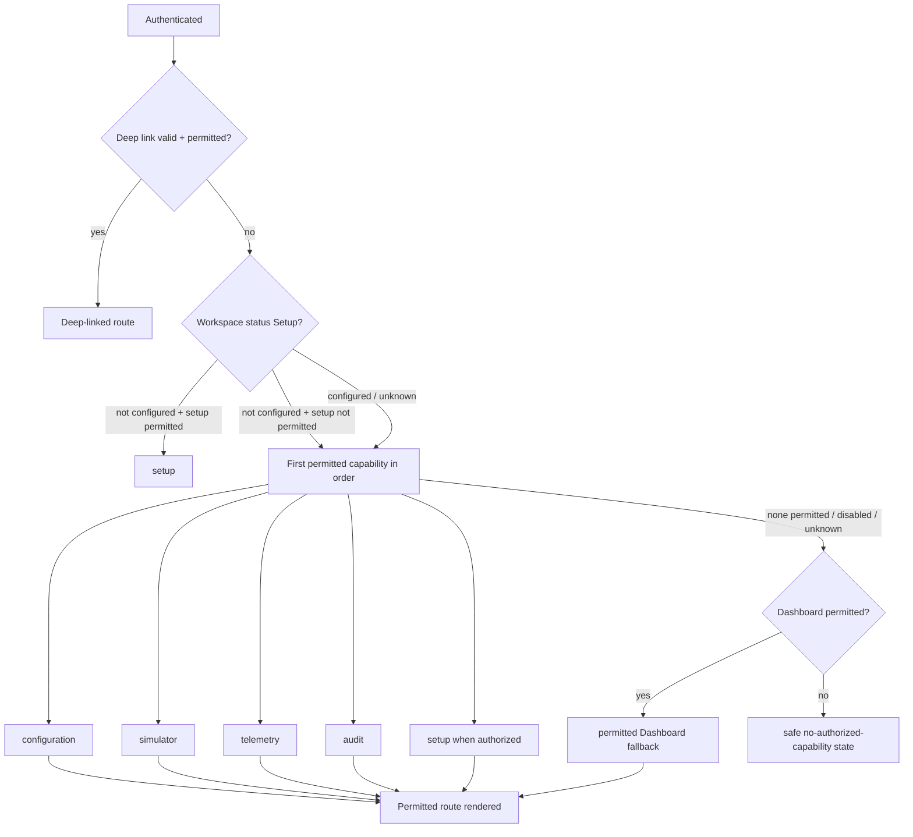

# Route and Permission Matrix

**Feature**: 004 Industrial Operations UI/UX Redesign
**Created**: 2026-08-04

## 1. Route inventory (unchanged route set; presentation-only changes)

| Route | Screen | Included surface | Status |
|---|---|---|---|
| `/dashboard` | Operational Dashboard | Redesign (Phase 2) | Included |
| `/telemetry` | Current Measurement & Source Health | Redesign (Phase 2) | Included |
| `/configuration` | Configuration hub (7 entities) | Redesign (Phase 3) | Included |
| `/simulator` | Simulator workspace + run history | Redesign (Phase 4) | Included |
| `/audit` | Audit log + investigation detail | Redesign (Phase 4) | Included |
| `/setup` | Setup wizard | Shell-consistent pass (Phase 1) | Included |
| `/` (root) | Landing resolution | Phase 1 (D-001) | Included |

No new routes are added; no new backend contract or capability is introduced (FR-022/026).

## 2. Permission visibility and landing

- Effective authorization is the source of truth; role names are optional orientation only
  (FR-001/028). Visibility/landing derive from existing session + workspace status data
  (`AuthSession`, `WorkspaceStatus`); no new authorization model is created.
- Navigation items without permission are hidden; the API remains the enforcement point; direct
  access uses the safe forbidden/not-found experience with next permitted action and no metadata
  leak (FR-023).
- Conditional capabilities (Trusted Telemetry Ingestion, CSV import, Rules, Alerts,
  Notifications, Reports, Edge, Modbus, savings, AI/ML, equipment control, deployment approval)
  are never presented (FR-026).

## 3. Landing priority (FR-028, D-001)

## 4. Per-route permission behavior

| Route | Visible when | Direct-access outcome when not permitted | Notes |
|---|---|---|---|
| dashboard | Dashboard permission is effective and route is enabled | safe forbidden/not-found + next action | fallback target only when Dashboard is permitted |
| configuration | user has any configuration entity permission | safe forbidden/not-found | entities filtered by Site/Area scope |
| simulator | user has simulator run permission | safe forbidden/not-found | run ops reflect server outcomes |
| telemetry | user has measurement/source-health access | safe forbidden/not-found | zero vs Missing preserved |
| audit | user has audit-view permission | safe forbidden/not-found | no target metadata leak; redaction kept |
| setup | setup permission is effective and workspace status requires setup | safe forbidden/not-found + next action | never shown solely because workspace is not configured |

## 5. Session-expiry return rule (FR-023)

After expiry, the prior route is restored only when it remains valid and permitted; otherwise the
landing fallback is used without probing or revealing unauthorized capability/object metadata.

If no included capability is permitted, the UI presents a safe no-authorized-capability state with
only the permitted next action (for example, contact an administrator). It never routes through
Dashboard or another forbidden page and never reveals capability names, counts, or object metadata
outside the user's effective scope.

## 6. Deep-link rules

- Valid permitted deep links take precedence over default landing (SC-015).
- Unknown/expired/unauthorized deep links use the safe forbidden/not-found experience; never route
  through a forbidden page.
- No landing preference or persistence is introduced (FR-028).
