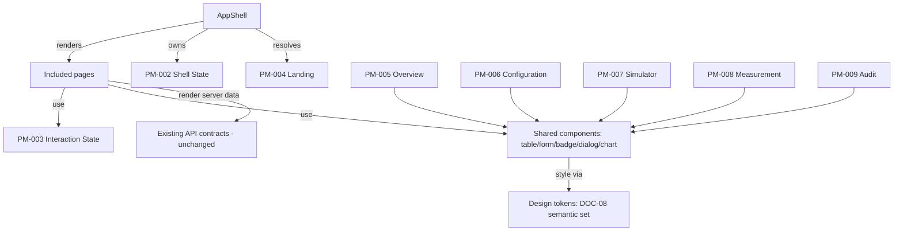

# Data Model: Industrial Operations UI/UX Redesign

**Feature**: 004 Industrial Operations UI/UX Redesign
**Created**: 2026-08-04

## 1. Boundary statement

Feature 004 is a **presentation-only** feature. It introduces **no new business entities**, no
database tables, no new backend contracts, and no changes to existing server behavior. Everything
modeled below is frontend state that renders existing server data (Feature 003 contracts) with a
new visual treatment. FR-022 requires this explicitly: a UI change must not introduce a substitute
data store or new backend capability.

The entities below are **presentation models** typed in the Web application; they are never
persisted by the client and never sent back to the API.

## 2. Presentation models

### PM-001 — Application Context

The selected operational context shown across the shell and data-bearing pages.

| Field | Type | Source | Notes |
|---|---|---|---|
| `selectedSiteId` | `string \| null` | WorkspaceStatus / search params | From existing `WorkspaceStatusRequest` (`selectedSiteId`) |
| `selectedAreaId` | `string \| null` | WorkspaceStatus / search params | Optional; `mode` param preserved |
| `timezone` | `string` | WorkspaceStatus | e.g. `Asia/Ho_Chi_Minh`; DOC-04 working default |
| `cutoffUtc` | `string \| null` | WorkspaceStatus | Data cutoff/freshness |
| `scopeLabel` | `string \| null` | `AuthSession` | Existing scope pill label |
| `landing` | `'Dashboard' \| 'Setup'` | WorkspaceStatus | Existing contract; drives D-001 landing |
| `live` / `stale` / `degraded` | derived | freshness calculation | FR-005 context flag |

FR-005: site/area, timezone, cutoff, and freshness must remain visible where applicable. One
permitted site/area must remain understandable (possibly non-editable) rather than disappearing
(edge case).

### PM-002 — Shell State (extended AppShellState)

Extends the existing pure state contract `AppShellState` from `app/AppShell.tsx` with UI
presentation fields (all client-only):

| Field | Type | Notes |
|---|---|---|
| `route` | `WebRoute` | Existing: `setup/dashboard/configuration/simulator/telemetry/audit` |
| `session` | `AuthSession` | Existing |
| `feedback` | `string` | Existing |
| `submitting` | `boolean` | Existing |
| `navMode` | `'expanded' \| 'rail' \| 'drawer-open'` | New, client-only; D-002/D-003 |
| `landingResolved` | `boolean` | New; guards one-shot landing resolution (D-001) |

Transitions (extend `transitionAppShell`): `session`, `submitting`, `signed-in`, `signed-out`,
`navigate` (existing) plus `nav-toggle` (rail↔drawer-open) and `nav-close` (drawer-open→rail).
Preference is never persisted.

### PM-003 — Interaction State (shared status model)

The existing `ManagementState` union in `ConfigurationManagementComponents.tsx` is promoted to the
shared contract for all included pages (research D-008). Every included page renders one of:

`loading | ready | forbidden | expired | no-data | validation | conflict | not-found |
dependency | runtime | error`

Each state requires: text label (Vietnamese), icon/shape (non-color cue, FR-016), impact, and next
action where recoverable (FR-004/FR-024, SC-004). `validation`/`conflict` add field-level details;
`dependency` adds the missing prerequisite and unblocks path; `error` retains correlation id where
the existing behavior provides one.

### PM-004 — Landing Resolution

Client-side decision record (D-001), derived from `AuthSession` + `WorkspaceStatus` + pathname:

| Priority | Input | Route |
|---|---|---|
| 1 | Valid permitted deep link (known included route + permitted) | that route |
| 2a | Not-configured workspace (`workspace.landing === 'Setup'` or status unavailable) | `setup` |
| 2b | First permitted priority capability | dashboard → configuration → simulator → telemetry → audit → setup |
| 3 | None permitted / unknown / disabled | `dashboard` (safe fallback) |

Session expiry returns to the prior route only when it remains valid and permitted; otherwise the
fallback (FR-023). Never redirects through a forbidden route; no landing preference persisted.

### PM-005 — Operational Overview (dashboard)

Read-only presentation of existing `OperationalDashboard` data with the Application Context added:

- Exceptions/attention items (ordered by severity + freshness), source health, coverage, quality
  summary, useful trends.
- Every condition labeled with impact + next step; configuration-absent distinguished from
  configured-but-not-receiving (FR-006, US2).
- Trend block uses the SVG chart contract (Missing = gap; unit/timezone/cutoff/grain/quality/
  coverage labels; data-table alternative).

### PM-006 — Configuration Record Presentation

Existing configuration entities (Site, Area, Asset, Measurement Point, Data Source, Source Mapping,
Simulator Configuration) rendered through shared table/detail/form contracts:

- Table row: status badge (text + icon), name/code, scope, key fields, row actions; compact density
  (D-012).
- Detail: read-only presentation of server data; Draft distinguishes editable fields (FR-008).
- Lifecycle action outcomes: success/failure/blocked/conflict/pending/completed-with-errors/
  retryable with reference id (FR-024); destructive actions require confirmation + reason
  (FR-014/FR-009).

### PM-007 — Simulator Workspace Presentation

Existing `SimulatorRoute` selection draft (site/area/asset/source/configurationId/version) and run
state rendered with the shared contracts; run outcomes shown with counters/reason, run id/history,
explicit next action; never implies physical equipment control (FR-010).

### PM-008 — Measurement Presentation

Existing `PointCurrentRoute` data rendered with zero-vs-Missing semantics preserved (FR-011):

- Valid zero: shows `0` + unit + observation timestamp + source timestamp + source + quality.
- No Data/Missing: distinct treatment, last-seen, expected interval, elapsed, source status.
- Quality: Good/Uncertain/Bad with text + icon/shape + reason (FR-012, SC-003).
- Time-series: SVG chart with gaps for Missing, never interpolated (FR-012).

### PM-009 — Audit Event Presentation

Existing `AuditRoute` data with preserved redaction regex contract; before/after diff rendered
readably with safe redaction; filters by actor/action/target/time/outcome/scope/correlation with
visible filter state + result count (FR-015, US6).

### PM-010 — Navigation Model

| Field | Type | Notes |
|---|---|---|
| `groups` | fixed group list | D-010: Vận hành, Cấu hình, Quản trị, Thiết lập |
| `visibleItems` | derived from effective permission | Permission-safe visibility from server data (never role-name gating) |
| `activeRoute` | `WebRoute` | current section; `aria-current="page"` |
| `navMode` | see PM-002 | expanded/rail/drawer-open |

Conditional capabilities never appear (FR-026). Icon-only rail items have accessible names and
tooltip/flyout (FR-002).

## 3. Validation and state-transition rules

- Landing resolution is one-shot per authenticated session (no loops, no forbidden-route
  redirection, no persistence) — FR-028/SC-015.
- Drawer lifecycle: closed → open (focus trap in) → Escape or backdrop or selection → close
  (focus returns to opener) — FR-020/SC-014. Background interaction blocked while open.
- Compact density applies only to operational tables/lists; no density switch — FR-027/SC-013.
- Light-only: no dark theme; dark media query removed — FR-017/D-011.
- No new routes, no new backend contracts, no new packages, no new business state — FR-022/
  FR-026/exclusions.

## 4. Relationships

No entity in this model is persisted, serialized to the API, or stored outside the running
browser session.
